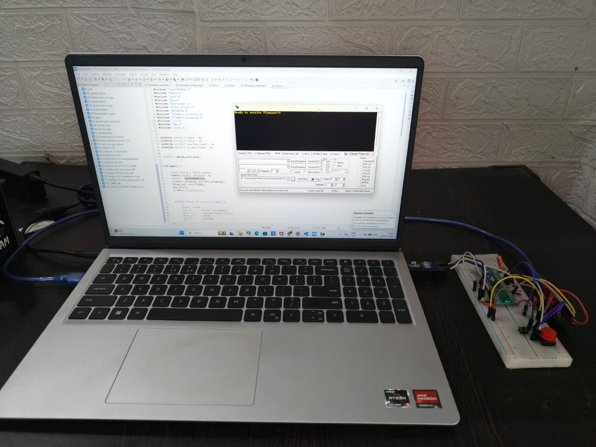
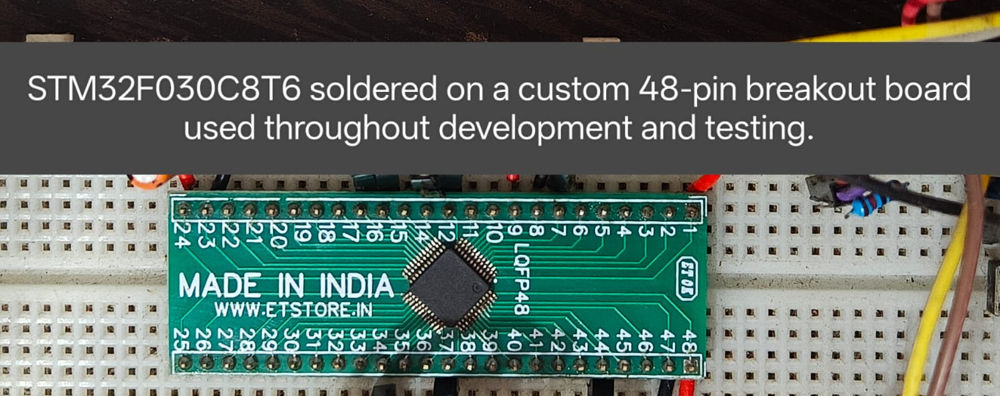
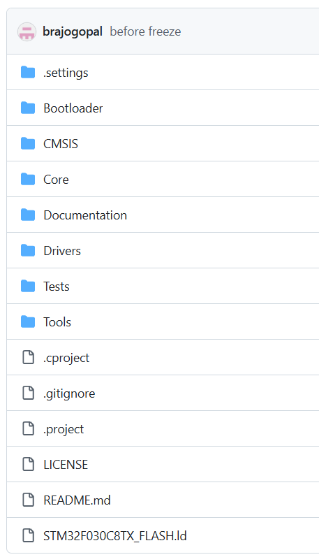
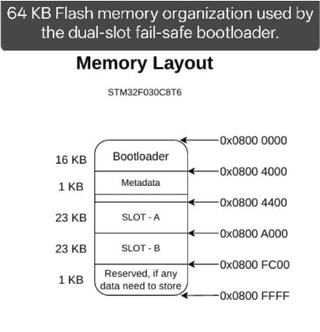
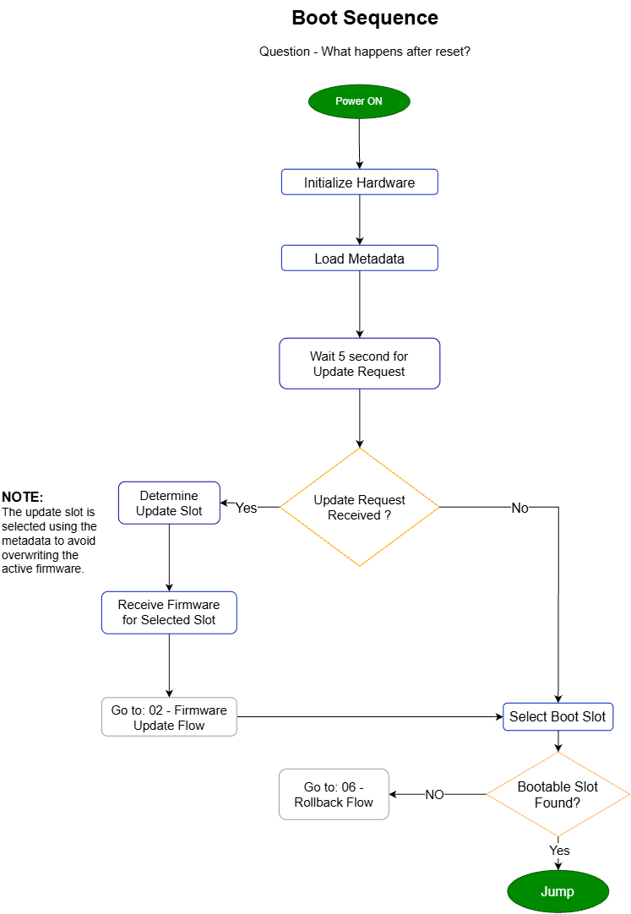
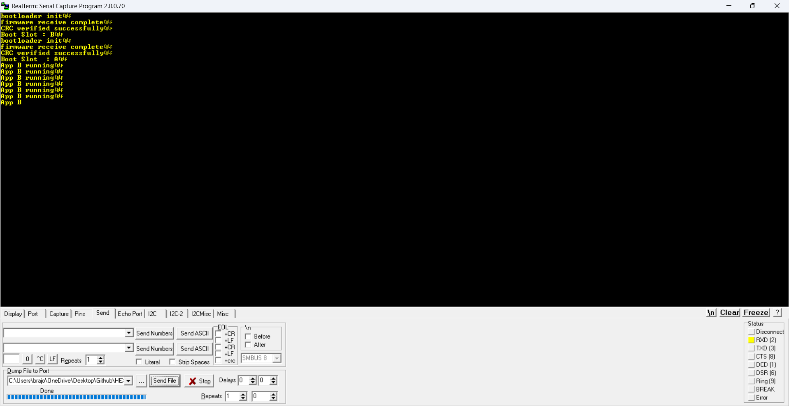

# HEXBOOT_F0
### Bare-Metal Dual-Slot Fail-Safe Bootloader for STM32F030C8T6

A production-inspired dual-slot UART bootloader written completely from scratch using
register-level programming.

This project was developed as part of my bare-metal embedded systems learning journey,
with the goal of understanding how commercial bootloaders work internally rather than
relying on vendor libraries.

> No HAL.
> No CubeMX.
> CMSIS register access only.

---

# Features

- Dual-slot firmware architecture
- UART firmware update
- DMA-based firmware reception
- CRC16 firmware validation
- Metadata-based slot management
- Automatic rollback support
- Bootable image verification
- Modular driver architecture
- Register-level peripheral drivers
- Zero dynamic memory allocation

---

# Hardware

**Microcontroller**

- STM32F030C8T6
- Cortex-M0
- 64 KB Flash
- 8 KB SRAM

Development was performed using a custom STM32F030C8T6 breakout board soldered by hand
instead of a commercial development board.

---

## Development Environment



---

## Hardware Test Setup


---

## STM32F030C8T6 Bare-Metal Test Board



---

# Repository Structure

```
HEXBOOT_F0
│
├── Bootloader/
├── Drivers/
├── Core/
├── CMSIS/
├── Common/
├── Documentation/
├── Tests/
└── Tools/
```

or



---

# Memory Layout

The bootloader occupies the first 16 KB of Flash followed by metadata and two
independent firmware slots.



---

# Boot Sequence

At reset the bootloader initializes the hardware, waits for an update request,
selects the appropriate firmware slot, validates the application and safely jumps
to the selected image.



---

# Test Result

Example output after successfully updating firmware and booting into Slot B.



---

# Documentation

Detailed design documentation is available in:

- Documentation/
- Architecture.pdf
- Execution Flow.pdf

Topics covered include:

- Repository architecture
- Driver architecture
- Bootloader architecture
- Memory layout
- Boot sequence
- Firmware update flow
- Metadata management
- Slot manager
- Rollback mechanism
- Application jump sequence

---

# Drivers

Implemented completely from scratch.

- GPIO
- RCC
- SysTick
- UART
- DMA
- FLASH
- CRC

---

# Design Philosophy

- Register-level programming only
- Independent driver modules
- Layered architecture
- Simple and readable code
- Portable design for future STM32H7 migration

---

# Future Roadmap

This repository is considered feature complete for the STM32F0 platform.

Future work will continue on:

- STM32H7
- BLE firmware update
- Wi-Fi update
- SHA-256 verification
- Secure boot

---

# License

MIT License